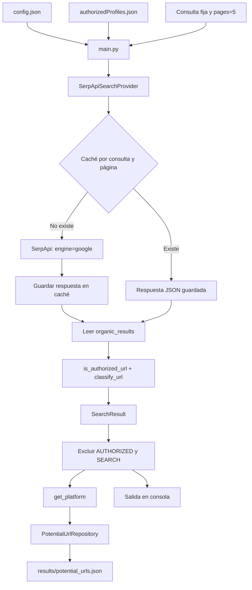
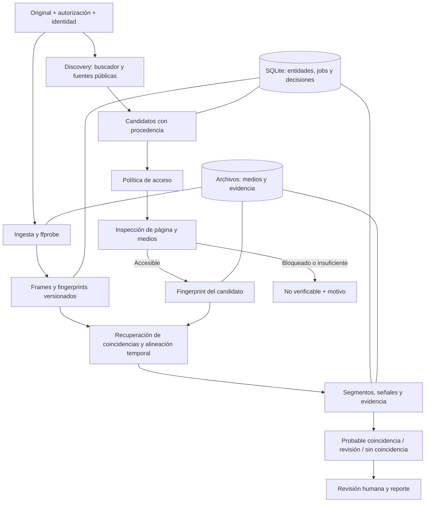

**El proyecto tiene una base aprovechable para descubrir URLs, pero todavía no tiene un sistema de detección de copias audiovisuales.** La evolución más corta consiste en conservar SerpApi, corregir el manejo de candidatos y añadir verificación temporal de frames con evidencia reproducible. Ampliar primero el número de buscadores aumentaría las URLs acumuladas sin resolver la incertidumbre principal: cuáles contienen realmente el video original.

Inspeccioné los 12 archivos Python, configuración, perfiles, resultados y los 67 JSON de caché. También consulté documentación técnica primaria. No modifiqué archivos, instalé dependencias ni ejecuté el programa, porque su ejecución realiza búsquedas y escrituras. Los hallazgos de código son de análisis estático; no constituyen una prueba del funcionamiento actual de servicios externos.

**1. Resumen ejecutivo**

El estado real es:

| Área | Situación actual |
|---|---|
| Descubrimiento | Google mediante SerpApi, con consultas manuales |
| Otros proveedores | Google Custom Search implementado pero desconectado; navegador experimental; mock |
| Paginación | Número fijo de páginas en SerpApi |
| Caché | JSON por consulta y página, sin caducidad |
| Clasificación | Reglas limitadas para búsqueda, contenido y perfiles |
| Persistencia | Lista de URLs agrupadas por una etiqueta derivada del dominio |
| Originales audiovisuales | No hay videos ni catálogo de obras |
| Fingerprinting y comparación | No implementados |
| Evidencia y revisión | No implementadas |

Los datos existentes contienen **201 URLs en 23 grupos**, sin duplicados exactos dentro del conjunto inspeccionado. Aplicando las reglas actuales, **40 se clasifican como `CONTENT` y 161 como `UNKNOWN`**. Esto no demuestra que las 40 contengan videos ni que las demás sean irrelevantes.

Tres distinciones deben orientar el producto:

- **Descubrir una URL no equivale a acceder a su video.**
- **Encontrar el mismo material audiovisual no demuestra que su publicación carezca de autorización.**
- **Generar fingerprints no permite buscar automáticamente en todo Internet:** hacen falta candidatos accesibles, un índice propio o una fuente que ofrezca búsqueda por contenido.

El MVP debe expresar esas diferencias en sus estados y reportes.

**2. Arquitectura actual**

La ruta ejecutada está en [main.py](C:/Users/ceric/OneDrive/Documentos/codigos/FernandaShows/main.py:18). Se ejecuta desde el nivel superior del módulo, sin función `main()` ni protección `if __name__ == "__main__"`.

La consulta está escrita directamente en el código. Incluir el nombre de un dominio como texto **no restringe necesariamente los resultados a ese dominio**, como haría una consulta `site:`.

Los módulos se distribuyen así:

| Módulo | Función real |
|---|---|
| [search_provider.py](C:/Users/ceric/OneDrive/Documentos/codigos/FernandaShows/search/search_provider.py:5) | Interfaz abstracta `search(query)` |
| [serpapi_search_provider.py](C:/Users/ceric/OneDrive/Documentos/codigos/FernandaShows/search/serpapi_search_provider.py:9) | Consulta Google, pagina, usa caché y añade clasificación/autorización |
| [search_service.py](C:/Users/ceric/OneDrive/Documentos/codigos/FernandaShows/search/search_service.py:5) | Envuelve un proveedor y añade autorización; no participa en `main.py` |
| [web_search_provider.py](C:/Users/ceric/OneDrive/Documentos/codigos/FernandaShows/search/web_search_provider.py:7) | Consulta Google Custom Search mediante `requests`; una página |
| [google_search_provider.py](C:/Users/ceric/OneDrive/Documentos/codigos/FernandaShows/search/google_search_provider.py:7) | Abre Google con Playwright, espera interacción y devuelve `[]` |
| [mock_search_provider.py](C:/Users/ceric/OneDrive/Documentos/codigos/FernandaShows/search/mock_search_provider.py:5) | Devuelve dos resultados fijos |
| [search_result.py](C:/Users/ceric/OneDrive/Documentos/codigos/FernandaShows/models/search_result.py:3) | Dataclass con título, URL, snippet, source, authorized y url_type |
| [search_cache.py](C:/Users/ceric/OneDrive/Documentos/codigos/FernandaShows/cache/search_cache.py:6) | Persistencia de respuestas completas en JSON |
| [potential_url_repository.py](C:/Users/ceric/OneDrive/Documentos/codigos/FernandaShows/storage/potential_url_repository.py:5) | Lectura y reescritura del inventario de URLs |
| [url_classifier.py](C:/Users/ceric/OneDrive/Documentos/codigos/FernandaShows/utils/url_classifier.py:4) | Clasificación heurística por host, ruta y query |
| [url_utils.py](C:/Users/ceric/OneDrive/Documentos/codigos/FernandaShows/utils/url_utils.py:3) | Normalización, autorización por ruta y agrupación de plataforma |

No encontré implementación de búsquedas internas de plataformas, expansión de perfiles, crawling, inspección de páginas ni descarga de medios. Los experimentos mencionados pueden haberse realizado fuera de esta carpeta, pero no están representados aquí.

`originals` contiene únicamente la configuración de identidad y perfiles. `matchings` está vacío.

Las dependencias externas importadas son `serpapi`, `requests` y `playwright`; el resto es biblioteca estándar. No encontré manifiesto de dependencias, versiones fijadas, pruebas, README ni configuración de CI. Los `.pyc` sugieren ejecuciones anteriores con CPython 3.14, pero no prueban que ese sea el entorno reproducible requerido.

**3. Problemas encontrados**

| Prioridad | Hallazgo | Consecuencia |
|---|---|---|
| Alta | `authorized` se calcula comparando dominio y primer segmento de ruta | Se confunde reconocimiento de una cuenta con autorización de publicación |
| Alta | El repositorio convierte JSON corrupto en inventario vacío | Una escritura posterior puede reemplazar el inventario anterior |
| Alta | Clave no vacía almacenada en `config.json` | Riesgo de exposición al compartir o sincronizar la carpeta |
| Alta | Persistencia sin transacciones ni escritura atómica | Riesgo de corrupción y pérdida de actualizaciones concurrentes |
| Media | Clasificación muy incompleta | Perfiles, listados y páginas de contenido se mezclan |
| Media | Se pierde la procedencia al guardar candidatos | No se conserva en el inventario qué consulta o ejecución encontró cada URL |
| Media | Caché permanente con clave incompleta | Resultados obsoletos y reutilización incorrecta al cambiar parámetros |
| Media | Paginación fija y errores sin tratamiento propio | Costos innecesarios y fallos difíciles de distinguir de cero resultados |
| Media | Responsabilidades duplicadas entre proveedor y servicio | Comportamiento distinto al cambiar de proveedor |
| Media | Rutas relativas al directorio de ejecución | El programa puede fallar al iniciarse desde otra carpeta |
| Media | Importar `main.py` ejecuta el trabajo | Dificulta pruebas, reutilización y control de efectos secundarios |

Los detalles más relevantes son los siguientes.

**La autorización necesita otro modelo.** En [url_utils.py](C:/Users/ceric/OneDrive/Documentos/codigos/FernandaShows/utils/url_utils.py:15) se asume que el primer segmento de una URL identifica al propietario. Esto puede servir para algunas rutas de usuario, pero no para publicaciones con rutas independientes del perfil, como `/p/...`.

Además, `x.com` y `twitter.com` no se reconocen como alias entre sí. Los campos `identity.aliases`, `authorizedDomains`, `platform` y `username` del archivo de perfiles no participan en la búsqueda o decisión actual.

No corregiría esto usando una lista de dominios autorizados: que una cuenta legítima publique en una plataforma no autoriza todas las publicaciones de esa plataforma.

**La clasificación contiene errores concretos.** En [url_classifier.py](C:/Users/ceric/OneDrive/Documentos/codigos/FernandaShows/utils/url_classifier.py:16):

- Una publicación ordinaria de X con `/usuario/status/id` queda como `UNKNOWN`.
- `endswith("tiktok.com")` también acepta un host como `not-tiktok.com`.
- Buscar subcadenas como `/popular` puede clasificar un slug de contenido como búsqueda.
- Rutas de etiquetas, álbumes y listados no están modeladas de forma general.
- Reconocer `CONTENT` por la ruta no comprueba que exista un medio reproducible.

**La deduplicación solo compara strings.** En [potential_url_repository.py](C:/Users/ceric/OneDrive/Documentos/codigos/FernandaShows/storage/potential_url_repository.py:73) no se utiliza `normalize_url`.

El inventario contiene variantes regionales y rutas que aparentan compartir identificadores de contenido. Eso merece canonicalización por plataforma, pero no basta para afirmar que sean duplicados audiovisuales.

Tampoco conectaría directamente el normalizador existente: elimina toda la query y podría colapsar URLs distintas como `watch?v=A` y `watch?v=B`.

**La plataforma se deriva incorrectamente del dominio.** `get_platform()` toma la penúltima etiqueta del host. Así aparecen grupos como `t` para `t.me` y `us` para `camwhores.us.com`; además, puede mezclar dominios distintos que compartan esa etiqueta.

Usaría `platform_id` explícito para plataformas conocidas y conservaría el hostname completo para las desconocidas.

**La caché dificulta el monitoreo.** Su clave contiene únicamente consulta y página. No incluye motor, región, idioma, dispositivo o versión de parámetros. No tiene TTL.

Los 67 archivos inspeccionados incluyen nueve respuestas sin resultados orgánicos y dos con un campo `error` que indica ausencia de resultados. No significa que sean dos fallos de infraestructura, pero demuestra que hay estados distintos que el código reduce a una lista vacía.

**La persistencia pierde contexto.** Se guardan solo plataforma y URL. El título, snippet, clasificación y proveedor desaparecen del inventario. Parte de la procedencia podría reconstruirse desde la caché, pero no existe una relación explícita y durable entre ambos.

Cada URL nueva provoca lectura y reescritura del archivo completo, una estrategia que empeora rápidamente con el volumen.

**Google Custom Search no es una base estratégica viable.** La documentación oficial indica que está cerrado a clientes nuevos y que los existentes deben migrar antes del **1 de enero de 2027**. Mantendría ese adaptador únicamente si todavía aporta valor a una cuenta existente. [Documentación de Google](https://developers.google.com/custom-search/v1/overview).

**4. Brechas y arquitectura propuesta**

| Prioridad | Brecha | Qué permite resolver |
|---|---|---|
| Crítico | Registro de cliente, obra y autorización | Saber qué se protege y por qué |
| Crítico | Ingesta y análisis del original | Obtener referencias audiovisuales utilizables |
| Crítico | Inspección y adquisición legítima del candidato | Pasar de URL a material verificable |
| Crítico | Fingerprints y alineación temporal | Detectar material compartido y fragmentos |
| Crítico | Dataset etiquetado y calibración | Medir precisión y controlar falsos positivos |
| Crítico | Evidencia y estados de incertidumbre | Reportar resultados defendibles |
| Crítico antes de descargar | Seguridad de red y procesamiento multimedia | Evitar SSRF y archivos maliciosos |
| Importante | Discovery extensible y expansión pública | Mejorar cobertura fuera del buscador |
| Importante | Persistencia transaccional y procedencia | Reanudar, auditar y deduplicar |
| Importante | Jobs, límites y observabilidad | Operar sin perder trabajo ni presupuesto |
| Importante | Separación entre clientes | Evitar mezclas de datos y decisiones |
| Futuro | Embeddings especializados e índices aproximados | Mejorar casos difíciles y grandes catálogos |
| Futuro | Planificación asistida por LLM | Ayudar a proponer nuevas fuentes y consultas |
| Futuro | Distribución horizontal y GPU | Aumentar capacidad cuando las métricas lo justifiquen |

Propondría **un monolito modular de Python, SQLite y un worker local**, con archivos audiovisuales fuera de la base de datos. No hacen falta microservicios, Kafka ni una base vectorial para el primer milestone.

El modelo mínimo distinguiría:

| Entidad | Información principal |
|---|---|
| Cliente y autorización | Alcance, vigencia y referencia documental |
| Original | ID, cliente, checksum, duración y ubicación |
| Identidad/perfil | Alias y cuentas relacionadas, con procedencia |
| Candidato | URL original, canónica, plataforma y tipo |
| Descubrimiento | Consulta, proveedor, fecha y candidato padre |
| Medio candidato | Un medio concreto de una página; una página puede contener varios |
| Fingerprint | Algoritmo, versión, parámetros, timestamps y artefacto |
| Verificación | Original, medio candidato, segmentos, señales y decisión |
| Job | Estado, intentos, próximo intento y error |
| Revisión | Decisión humana, autor y fecha |

Separaría expresamente:

- Coincidencia audiovisual.
- Cuenta reconocida.
- Permiso de publicación.
- Conclusión sobre posible infracción.

**5. Estrategia de discovery**

Elegiría **providers y adapters en código, apoyados por configuración declarativa**.

| Enfoque | Uso recomendado |
|---|---|
| Provider | Fuente de candidatos: buscador, índice o búsqueda pública |
| Adapter | Conocimiento de una plataforma: rutas, paginación, extracción y canonicalización |
| Configuración | Dominios, patrones, selectores sencillos, límites y capacidades |
| Plugins | Registro interno de componentes; distribución externa solo si después resulta necesaria |
| Agentes/LLM | Asistencia acotada para proponer consultas o adaptaciones |
| Orquestador determinista | Presupuesto, deduplicación, estados, prioridades y política de acceso |

No intentaría expresar cualquier sitio mediante un archivo de selectores. Las plataformas con navegación dinámica, varios medios por página o paginación especial necesitarán código específico. La reutilización debe estar en la infraestructura común.

Cada adapter declararía qué capacidades soporta: búsqueda pública, listado de perfil, inspección de página o resolución de medios. No todos deben implementarlas todas.

El flujo sería:

1. Generar consultas desde identidad, aliases y títulos disponibles.
2. Consultar fuentes con presupuesto por ejecución.
3. Conservar resultados y procedencia.
4. Canonicalizar y clasificar.
5. Usar perfiles, etiquetas y listados como semillas de expansión.
6. Extraer páginas de contenido mediante adapters habilitados.
7. Enviar medios accesibles a verificación.
8. Registrar dominios nuevos como fuentes pendientes de evaluación.

**Las páginas de búsqueda y perfiles deben conservarse como semillas**, aunque no sean candidatos audiovisuales verificables por sí mismos. El filtro actual elimina parte de ese valor.

La expansión tendría límites de profundidad, páginas por perfil, solicitudes por host, bytes, duración y candidatos nuevos. Un conjunto de visitados y cursores persistentes evitaría ciclos.

Las búsquedas de identidad se ejecutarían por creador y ventana temporal, reutilizando sus candidatos para los originales correspondientes. Repetir las mismas consultas por cada video multiplicaría el gasto sin aportar cobertura proporcional.

El LLM podría sugerir variantes de consultas, resumir fallos de adapters o proponer reglas para revisión. **No decidiría si dos videos son copias, no concedería autorización de acceso y no tendría navegación abierta sin límites.** Para el MVP puede omitirse por completo.

Si el único insumo es un video sin identidad, aliases ni pistas públicas, discovery será considerablemente más difícil. La búsqueda inversa de frames podría ser una fuente futura, pero tampoco garantiza cobertura universal.

**6. Estrategia de fingerprinting**

La unidad de comparación debe ser **una secuencia temporal de señales**, no un hash único del archivo ni un frame aislado.

| Técnica | Ventajas | Limitaciones y falsos positivos | Costo y papel |
|---|---|---|---|
| SHA-256 del archivo | Identifica bytes idénticos | Cualquier transformación cambia el hash | Muy bajo; integridad y duplicados exactos |
| pHash/PDQ por frame | Compacto; útil ante recompresión y reducción de resolución | Recortes, overlays y escenas poco distintivas pueden degradarlo | Bajo; primera etapa |
| Secuencia de fingerprints | Permite buscar segmentos y desplazamientos | Necesita alineación; comparación exhaustiva escala mal | Bajo–medio; núcleo del MVP |
| Embeddings especializados en copias | Pueden recuperar transformaciones visuales más difíciles | Requieren validación, versiones y umbrales propios | Medio–alto; segunda etapa |
| Embeddings semánticos generales | Recuperan parecido visual o temático | Misma persona o escenario no implica mismo video | Solo recuperación auxiliar |
| Audio por landmarks | Puede localizar fragmentos aunque cambie la imagen | Música compartida puede generar coincidencias engañosas; falla con audio reemplazado | Bajo–medio; apoyo |
| Combinación multimodal | Aporta señales complementarias | Una fusión ingenua también puede amplificar errores | Incremental; sin exigir siempre audio |

Los hashes perceptuales describen características del contenido en lugar de identidad de bytes; pHash documenta también firmas variables para video. Esto no implica invariancia universal ante cualquier transformación. [Diseño de pHash](https://phash.org/docs/design.html).

**Implementación inicial propuesta**

1. **Inspección y normalización.** Obtener duración, streams, rotación y timestamps; aplicar orientación correcta y conservar relación de aspecto.
2. **Muestreo temporal.** Empezar evaluando aproximadamente un frame por segundo, complementado con cambios de escena. Es un parámetro de benchmark, no una garantía para clips muy cortos.
3. **Calidad.** Reducir el peso de frames negros, casi uniformes, repetidos o genéricos.
4. **Firma visual.** pHash como baseline sencillo; comparar PDQ/vPDQ en el mismo benchmark.
5. **Recuperación de pares de frames.** Buscar firmas cercanas.
6. **Alineación.** Exigir correspondencias ordenadas con desplazamiento temporal consistente.
7. **Refinamiento.** Muestrear más densamente alrededor de los segmentos candidatos.
8. **Decisión explicable.** Guardar duración coincidente, cobertura, calidad y ambigüedad.

FFmpeg ofrece filtros para selección temporal y por escenas, por lo que esa parte no requiere un modelo generativo. [Documentación de filtros](https://ffmpeg.org/ffmpeg-filters.html).

Para un candidato recortado al inicio, las correspondencias podrían seguir aproximadamente:

`t_original ≈ t_candidato + desplazamiento`

Si hay cortes internos, se necesitan varios segmentos coherentes. No basta con comparar “frame 10 contra frame 10”.

Evaluaría específicamente **vPDQ**: su documentación contempla coincidencias de subsecuencias y clips. TMK+PDQF ofrece una firma fija, pero está orientado a videos de longitud equivalente; por eso no lo elegiría como única técnica para este objetivo. [Comparación oficial vPDQ/TMK](https://github.com/facebook/ThreatExchange/tree/main/vpdq).

**Recortes espaciales, watermark y relación de aspecto**

Son los casos donde un hash global de frame puede quedarse corto. Probaría, en este orden:

- Normalización de orientación y bandas.
- Comparación de frame completo y algunas regiones predefinidas.
- Confirmación geométrica con correspondencias locales en casos ambiguos.
- Embeddings entrenados para detección de copias.

No eliminaría grandes regiones de forma indiscriminada: puede aumentar similitudes accidentales.

SSCD es una referencia pertinente porque fue desarrollado para detección de copias de imágenes. Lo evaluaría por frame, añadiendo alineación temporal propia. Su repositorio está archivado, por lo que habría que revisar mantenimiento y compatibilidad antes de adoptarlo. [Repositorio de SSCD](https://github.com/facebookresearch/sscd-copy-detection).

**Audio y fusión**

Un sistema de landmarks puede aportar offsets e intervalos coincidentes; `audfprint` documenta ambos. No trasladaría sus umbrales de ejemplo directamente al producto. [Documentación de audfprint](https://github.com/dpwe/audfprint).

Una coincidencia de audio aislada sería una pista, especialmente si puede corresponder a música reutilizada. La ausencia de audio no debe impedir una coincidencia visual fuerte.

No comenzaría con una fórmula arbitraria del tipo “70 % visual + 30 % audio”. Primero usaría reglas calibradas con señales separadas. Un score de similitud **no se presentaría como probabilidad** sin calibración estadística.

**Validación necesaria**

El corpus debe incluir originales autorizados, transformaciones individuales y combinadas, clips parciales y negativos difíciles:

- Otros videos del mismo creador.
- Mismo escenario o vestuario.
- Misma música.
- Intros, watermarks o thumbnails compartidos.
- Videos sin audio.
- Candidatos que solo contienen una imagen del original.

Separaría calibración y evaluación por original, evitando que transformaciones del mismo video estén en ambos conjuntos.

Mediría precisión, recall por transformación, falsos positivos por candidato, localización temporal, tiempo de procesamiento y porcentaje no verificable. No es posible prometer precisión real con el inventario actual: no contiene etiquetas ni medios de referencia.

**7. Ejecución, escalabilidad y límites**

Para el MVP:

| Operación | Ejecución |
|---|---|
| Registrar original y consultar resultados | Síncrona mediante CLI |
| Discovery y navegación | Jobs asíncronos con límites por host |
| Descarga | Worker de I/O con límites de tamaño y tiempo |
| Decodificación y fingerprints | Subprocesos de CPU aislados |
| Comparación | Job reanudable |
| Evidencia y reporte | Después de completar la verificación |

Una tabla `jobs` en SQLite es suficiente para una cola local inicial. Incluiría estados, intentos, próxima ejecución y recuperación de trabajos interrumpidos. Usaría entrega al menos una vez y operaciones idempotentes.

Los estados distinguirían `sin_coincidencia`, `evidencia_insuficiente`, `acceso_restringido` y `error_temporal`. Un fallo de descarga no debe convertirse en un negativo audiovisual.

La evidencia incluiría URL y fecha, checksum del material analizado, versiones del algoritmo, timestamps emparejados, frames representativos, cobertura de ambos videos y decisión. Una coincidencia de 30 segundos dentro de un original de 20 minutos debe reportarse como segmento compartido.

| Escala | Evolución recomendada |
|---|---|
| 1 cliente / 100 videos | SQLite local, un worker, archivos locales y búsqueda por identidad; comparación dentro del catálogo |
| 100 clientes / 10.000 videos | PostgreSQL, almacenamiento de objetos, workers separados por I/O y CPU, cola compartida y cuotas por cliente |
| 10.000 clientes / millones de fingerprints | Índices especializados, particiones, procesamiento por lotes, recuperación aproximada y verificación temporal del conjunto reducido |

“Millones de fingerprints” no equivale a millones de videos. Como ejemplo de dimensionamiento, a un frame por segundo y diez minutos por video:

- 100 videos: 60.000 firmas.
- 10.000 videos: 6 millones.
- Un millón de videos: 600 millones.

Con firmas de 256 bits, son aproximadamente 1,9 MB, 192 MB y 19,2 GB de hashes crudos, respectivamente. Faltan timestamps, índices, audio, evidencia y medios, que pueden dominar el almacenamiento.

Evitaría comparar cada frame contra todos los frames del catálogo. Primero se recuperan candidatos cercanos y después se verifica su consistencia temporal.

Las decisiones que preservan la evolución son IDs estables, `tenant_id`, fingerprints versionados, repositorios con interfaces pequeñas, jobs idempotentes y medios separados de metadatos.

**Seguridad y alcance legítimo**

Antes de activar adquisición multimedia implementaría:

- Solo HTTP/HTTPS y validación de destinos.
- Bloqueo de IP privadas, loopback, link-local y endpoints de metadata.
- Revalidación en redirecciones y resolución DNS.
- Control equivalente para URLs de playlists y segmentos.
- Límites de bytes, duración, resolución, tiempo, memoria y disco.
- Decodificación aislada, sin acceso libre a red.
- Argumentos de subprocess sin interpolación de shell.

Estos controles responden al riesgo de SSRF al procesar URLs externas. [Guía de OWASP](https://cheatsheetseries.owasp.org/cheatsheets/Server_Side_Request_Forgery_Prevention_Cheat_Sheet.html).

Ante login, CAPTCHA, paywall, DRM o denegación de acceso, el adapter debe detenerse y registrar el motivo. Un `429` requiere espera y reducción de frecuencia.

Aplicaría una política de crawling que respete `robots.txt` y condiciones aplicables; `robots.txt` no constituye autorización de acceso, como aclara su estándar. [RFC 9309](https://www.rfc-editor.org/rfc/rfc9309.html).

Que algo esté públicamente visible tampoco lo convierte en contenido de libre uso. La autorización del cliente, las condiciones de la fuente y las reglas jurisdiccionales sobre reproducción, conservación y reclamaciones deben evaluarse por separado. [OMPI sobre copyright en Internet](https://www.wipo.int/en/web/ipday/2016/ip_digital).

Por la sensibilidad del material, establecería acceso por cliente, retención limitada, cifrado y borrado de derivados. Los fingerprints tampoco deben tratarse automáticamente como datos anónimos. No incluiría reclamaciones o notificaciones externas automáticas en el MVP.

**8. Roadmap priorizado**

Las rutas nuevas siguientes son propuestas relativas a la raíz del proyecto; no se han creado.

| Fase | Objetivo y componentes | Archivos existentes que modificaría | Módulos nuevos | Dependencias | Pruebas y criterio de cierre |
|---|---|---|---|---|---|
| **0. Discovery confiable** | CLI, secretos externos, procedencia, estados y persistencia transaccional | `main.py`, `config.json`, `search/search_service.py`, `search/serpapi_search_provider.py`, `cache/search_cache.py`, `storage/potential_url_repository.py`, ambos utilitarios de URL | `settings.py`, `models/candidate.py`, `storage/database.py`, `storage/migrations/`, `tests/`, manifiesto y README | Biblioteca estándar, SDK SerpApi fijado; `pytest` para desarrollo | URLs adversariales, parámetros significativos, expiración, error frente a vacío e importación del inventario. Termina cuando una búsqueda puede repetirse sin duplicar candidatos y conserva procedencia |
| **1. Verificación audiovisual local** | Original, frames, fingerprints, alineación y reporte entre dos archivos | `main.py` | `media/probe.py`, `media/frames.py`, `fingerprinting/visual.py`, `verification/temporal.py`, `verification/decision.py`, `evidence/report.py`, `benchmarks/` | FFmpeg/ffprobe, NumPy, Pillow e ImageHash para baseline; PDQ como alternativa evaluable | Transformaciones, clips y negativos difíciles. Termina con evaluación separada, umbrales congelados y segmentos explicables; el baseline no basta si falla el alcance acordado |
| **2. Milestone de Internet** | Conectar discovery a inspección pública, adquisición segura, worker y evidencia | `main.py`, `search/search_service.py`, repositorios de fase 0 | `inspection/service.py`, `platforms/registry.py`, un adapter concreto, `media/acquisition.py`, `security/url_policy.py`, `jobs/worker.py` | Un cliente HTTP y parser HTML; SQLite de biblioteca estándar | Redirecciones privadas, páginas con varios medios, acceso restringido, límites y reanudación. Termina cuando un original genera candidatos públicos y marca coincidencias probables con evidencia |
| **3. Discovery híbrido** | Expansión desde perfiles, etiquetas y búsquedas internas públicas | Interfaces y servicio de `search/`, caché y clasificación | `discovery/planner.py`, `discovery/frontier.py`, adapters adicionales y configuración declarativa | Reutilizar HTTP/parser; Playwright solo para una necesidad pública concreta | Cursores, ciclos, cambios de HTML, rate limits y comparación contra buscador solo. Termina cuando añade candidatos útiles dentro de presupuesto |
| **4. Robustez audiovisual** | Audio, regiones y embeddings especializados para fallos medidos | Extractor visual, alineación, decisión y benchmark | `fingerprinting/audio.py`, `fingerprinting/embeddings.py`, `verification/fusion.py` | Audio landmarks; PyTorch/SSCD u otra opción validada; OpenCV si aporta valor geométrico | Mejorar recall de casos difíciles manteniendo la precisión acordada. No se añade una técnica solo por disponibilidad |
| **5. Operación multicliente** | Aislamiento, cuotas, almacenamiento de objetos y capacidad horizontal | Repositorios, settings y jobs | Autenticación, migraciones PostgreSQL, adapter de objetos, observabilidad e índices | PostgreSQL y su driver; broker/índice según mediciones | Carga, recuperación, aislamiento y borrado. Termina al cumplir objetivos medidos de costo, latencia y confiabilidad |

La fase 2 es el milestone solicitado. La fase 3 amplía cobertura después de demostrar el recorrido completo. La fase 4 puede adelantarse parcialmente si el benchmark de la fase 1 muestra que el baseline no alcanza los recortes o watermarks requeridos.

**9. Qué implementaría primero y decisiones pendientes**

**La primera entrega sería un verificador local de dos videos con alineación temporal y reporte de segmentos, precedido por los ajustes mínimos para ejecutar y probar el proyecto sin efectos secundarios.**

Ese trabajo resuelve la mayor incertidumbre técnica: si el método distingue copias transformadas de otros videos visualmente parecidos. Después conectaría el verificador a SerpApi y a una sola plataforma pública elegida por accesibilidad y valor.

No empezaría por más buscadores, un agente autónomo, microservicios o una base vectorial. Ninguno sustituye esa validación.

Antes de modificar código necesitaría concretar:

1. **Alcance del primer piloto:** plataforma prioritaria y originales autorizados disponibles.
2. **Qué cuenta como coincidencia:** video casi completo, fragmento parcial y duración mínima útil.
3. **Errores tolerables:** precisión mínima para marcar automáticamente una coincidencia probable y volumen aceptable de revisión.
4. **Acceso y retención:** si podemos descargar temporalmente candidatos y cuánto conservar medios y evidencia.
5. **Entorno y presupuesto:** Windows o Linux, CPU/GPU disponible, almacenamiento y límite de consultas.
6. **Alcance de autorización:** cómo documentar derechos, publicaciones permitidas y revocaciones.

Con esas decisiones se puede convertir el roadmap en un primer cambio acotado y verificable, conservando la separación entre descubrimiento, coincidencia audiovisual y autorización de publicación.
